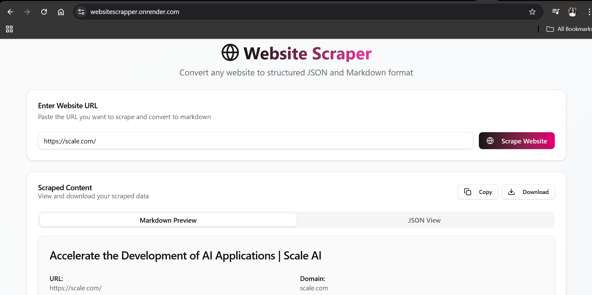
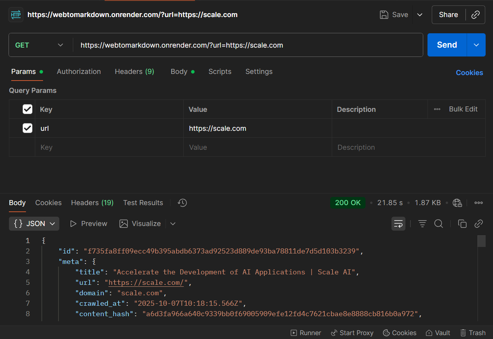

# 🌐 Web to Markdown Converter

A full-stack application that converts any webpage into **Markdown format** using a **headless Chromium browser (Playwright)** for web scraping.  
This repository contains **both Frontend (FE)** and **Backend (BE)** code, deployed using **Render** with a **Docker image** for backend api and static site for frontend application.

---

## 🚀 Live Demo

- **Frontend URL:** [https://websitescrapper.onrender.com/](https://websitescrapper.onrender.com/)
- **Backend API URL:** [https://webtomarkdown.onrender.com/](https://webtomarkdown.onrender.com/)

---

## 🧩 Project Overview

The **Web to Markdown Converter** allows users to input any website URL and get a clean, Markdown-formatted version of the page.  
It uses **Playwright with a headless Chromium browser** to render and scrape website content accurately before converting it to Markdown.


### ⚙️ Tech Stack

#### Backend:
- Node.js / Express.js  
- Playwright (for headless browser scraping)  
- Turndown to convert HTML into Markdown.
- Docker (for containerized deployment using Render)

#### Frontend:
- React.js  
- Shadcn components with Tailwind CSS  
- Axios (for API integration)

---

## 🧠 Features

- 🌍 Convert any public webpage into Markdown format/ copy or download its JSON format 
- ⚙️ Fast and efficient web scraping with Playwright  
- 🧱 Full-stack setup with separate FE/BE  
- 🚀 Deployed seamlessly using Render + Docker  
- 🧑‍💻 Can use either Frontend to scrap a single website or use the API to scrap multiple websites. 

---

## 🧾 How to Use the API



### **Base URL**
```bash
curl --location --request GET 'https://webtomarkdown.onrender.com/?url=https%3A%2F%2Fscale.com%2F' \
--header 'Content-Type: application/json'
